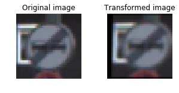
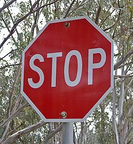
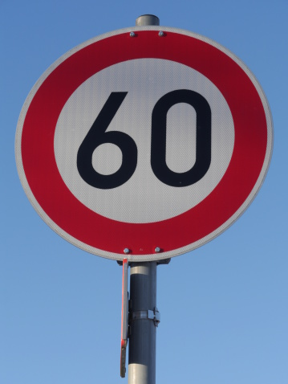
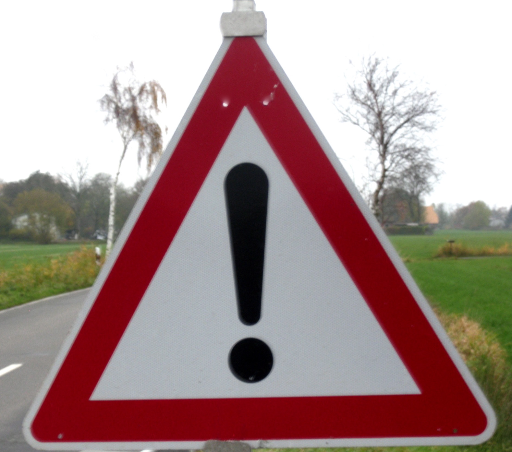

# Traffic Sign Recognition

## Build a Traffic Sign Recognition Project

The goals / steps of this project are the following:
* Load the data set (see below for links to the project data set)
* Explore, summarize and visualize the data set
* Design, train and test a model architecture
* Use the model to make predictions on new images
* Analyze the softmax probabilities of the new images
* Summarize the results with a written report

[//]: # (Image References)

[image1]: ./examples/visualization.jpg "Visualization"
[image2]: ./examples/grayscale.jpg "Grayscaling"
[image3]: ./examples/random_noise.jpg "Random Noise"
[image4]: ./examples/placeholder.png "Traffic Sign 1"
[image5]: ./examples/placeholder.png "Traffic Sign 2"
[image6]: ./examples/placeholder.png "Traffic Sign 3"
[image7]: ./examples/placeholder.png "Traffic Sign 4"
[image8]: ./examples/placeholder.png "Traffic Sign 5"

## Rubric Points
Here I will consider the [rubric points](https://review.udacity.com/#!/rubrics/481/view) individually and describe how I addressed each point in my implementation.  
You're reading it! and here is a link to my [project code](https://github.com/allendoss/CarND-Traffic-Sign-Classifier-Project/blob/master/Traffic_Sign_Classifier.ipynb)

### Data Set Summary & Exploration

#### 1. Provide a basic summary of the data set. In the code, the analysis should be done using python, numpy and/or pandas methods rather than hardcoding results manually.

I used the numpy and matplotlib library in python to analyze the traffic signs data set:

* The size of training set is 34799
* The size of the validation set is 4410
* The size of test set is 12630
* The shape of a traffic sign image is 32x32x3
* The number of unique classes/labels in the data set is 43

#### 2. Include an exploratory visualization of the dataset.

Here is an exploratory visualization of the data set. The histogram can be viewed below

### Design and Test a Model Architecture

#### 1. Describe how you preprocessed the image data. What techniques were chosen and why did you choose these techniques? Consider including images showing the output of each preprocessing technique. Pre-processing refers to techniques such as converting to grayscale, normalization, etc. (OPTIONAL: As described in the "Stand Out Suggestions" part of the rubric, if you generated additional data for training, describe why you decided to generate additional data, how you generated the data, and provide example images of the additional data. Then describe the characteristics of the augmented training set like number of images in the set, number of images for each class, etc.)

The following steps were taken to preprocess the data:
1. Data augmentation: From the histogram, it was clear that certain classes had sample images below the mean. Hence it was necessary to augment the data. This was done using the functions translate() and affineTransform(). Below is an example showcasing the transformation of a sample image in the data set.

2. Grayscaling: The images were in RGB format. The images were grayscaled to reduce the complexity of the problem. The grayscale function from opencv library was used.
3. Normalizing: The pixel values in the images were later normalized to values between 0 and 1. This was done to scale the pixel values for easy image processing by the CNN

The augmented training data set now contains 46714 sample images.

#### 2. Describe what your final model architecture looks like including model type, layers, layer sizes, connectivity, etc.) Consider including a diagram and/or table describing the final model.

My final model consisted of the following layers:

| Layer         		|     Description	        					|
|:---------------------:|:---------------------------------------------:|
| Input         		| 32x32x1 grayscaled image   							|
| Convolution-1 3x3     	| 1x1 stride, VALID padding, outputs 28x28x6 	|
| RELU					|												|
| Average pooling	      	| 2x2 stride, VALID padding, outputs 14x14x6 				|
| Convolution-2 3x3	    | 1x1 stride, VALID padding, outputs 10x10x16      									|
| RELU          |       |
| Average pooling	      	| 2x2 stride, VALID padding, outputs 5x5x16 				|
| Fully connected-1		| Input = 400, Output = 120        									|
| RELU					|												|
| Fully connected-2		| Input = 120, Output = 84        									|
| RELU					|												|
| Fully connected-3		| Input = 84, Output = 43        									|

#### 3. Describe how you trained your model. The discussion can include the type of optimizer, the batch size, number of epochs and any hyperparameters such as learning rate.

To train the model, the number of epochs were set to 10. Different batch sizes were tested to obtain one that yielded higher accuracy (batch size = 100). The mean and standard deviation were set  to default values of 1 and 0.1 respectively. The Adam optimizer was used to optimize the function.

#### 4. Describe the approach taken for finding a solution and getting the validation set accuracy to be at least 0.93. Include in the discussion the results on the training, validation and test sets and where in the code these were calculated. Your approach may have been an iterative process, in which case, outline the steps you took to get to the final solution and why you chose those steps. Perhaps your solution involved an already well known implementation or architecture. In this case, discuss why you think the architecture is suitable for the current problem.

My final model results were:
* validation set accuracy of 89.3%
* test set accuracy of 87.4%

If a well known architecture was chosen:
* What architecture was chosen? LeNet5 by Yan LeCun
* Why did you believe it would be relevant to the traffic sign application? The Lenet5  was chosen due to its efficient architecture for CNN problems. This architecture was also discussed in the class.
* How does the final model's accuracy on the training, validation and test set provide evidence that the model is working well? The model was able to detect new images with satisfactory results. Although additional image transformations functions may be required to improve the model's results
* Which parameters were tuned? How were they adjusted and why? The batch size was changed to increase the validation accuracy. The learning rate was also decreased from 0.01 to 0.005 due to large jumps between the accuracy results reported by epochs.

### Test a Model on New Images

#### 1. Choose five German traffic signs found on the web and provide them in the report. For each image, discuss what quality or qualities might be difficult to classify.

Here are five German traffic signs that I found on the web:

The above image is hard to classify due to the noise in the background-clouds
---

The above image is hard to classify due to additional artifacts on the sign board
---

The above image is hard to classify due to the noise in the background-branches
---

This image is relatively easy to classify
---

The above image has very high noise in background

#### 2. Discuss the model's predictions on these new traffic signs and compare the results to predicting on the test set. At a minimum, discuss what the predictions were, the accuracy on these new predictions, and compare the accuracy to the accuracy on the test set (OPTIONAL: Discuss the results in more detail as described in the "Stand Out Suggestions" part of the rubric).

Here are the results of the prediction:
On
| Image			        |     Prediction	        					|
|:---------------------:|:---------------------------------------------:|
| Right-of-way | Right-of-way (1st prediction)|
| Road work     | Road work (1st prediction) 										|
| STOP					| STOP	(1st prediction)									|
| 60 km/h	   		| (Failed to predict accurate sign)				 				|
| General caution			| General caution (1st prediction)      							|

The model was able to correctly guess 4 of the 5 traffic signs, which gives an accuracy of 80%. This compares favorably to the accuracy on the test set of 87.4%

#### 3. Describe how certain the model is when predicting on each of the five new images by looking at the softmax probabilities for each prediction. Provide the top 5 softmax probabilities for each image along with the sign type of each probability. (OPTIONAL: as described in the "Stand Out Suggestions" part of the rubric, visualizations can also be provided such as bar charts)

The code for making predictions on my final model is located in the 22nd cell of the Ipython notebook.

For the first image, the top five soft max probabilities were

| Probability         	|     Prediction	        					|
|:---------------------:|:---------------------------------------------:|
| 9.99815166e-01         			| Right-of-way at the next intersection   									|
| 1.47279687e-04     				| Beware of ice/snow 										|
| 3.56463752e-05					| No passing for vehicles over 3.5 metric tons											|
| 8.03059834e-07	      			| Double curve					 				|
| 5.86945305e-07			    | Slippery Road      							|

The other images and their probabilities can be obtained from the Ipython notebook.

### (Optional) Visualizing the Neural Network (See Step 4 of the Ipython notebook for more details)
####1. Discuss the visual output of your trained network's feature maps. What characteristics did the neural network use to make classifications?
